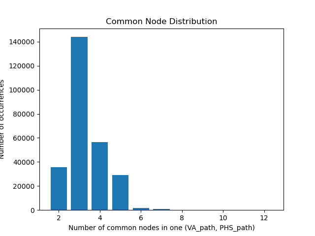
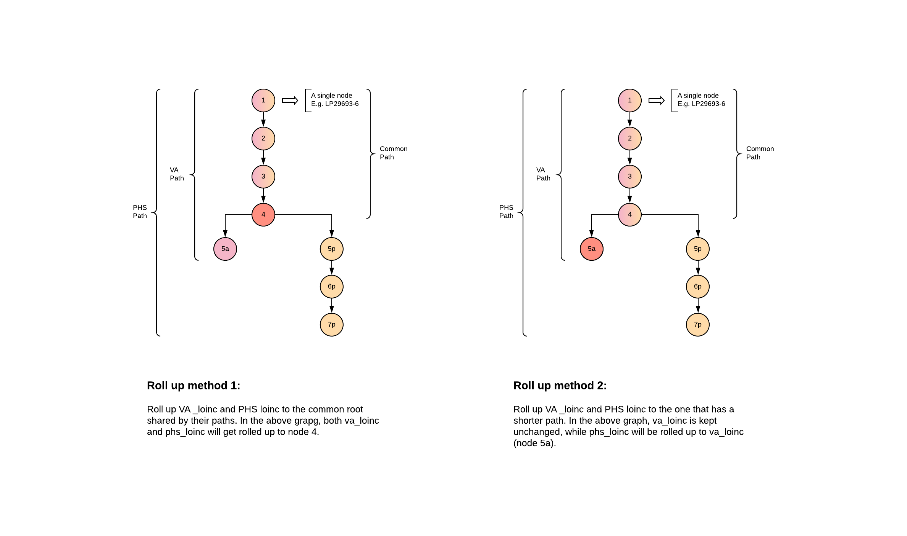

# LOINC - hierarchy level mapping
hierarchy levels are counted by counting previous "generations" of a LOINC code.\
e.g. a lonic code with the path 'LP29693-6.LP343406-7.LP7819-8.LP14559-6.LP98185-9.LP14082-9' 
should have a hierarchical number 7 since it has 6 linear parents.

For a detailed documentation, visit [here](https://docs.google.com/document/d/1fMmjrmlKOHVhPnxR3My1TnL4azSzdA_7BSg7912uz2c/edit?usp=sharing)

## output/roll_up
- raw.csv
csv roll_up results in loinc codes

- other csv 
csv roll_up results translated to human-readable texts.

- g2
with numbers of common nodes greater than 2

- g3
with numbers of common nodes greater than 3

- dist pngs
A distribution graph for common nodes shared by VA paths and PHS paths.

## Two rolling methods:

The result of the first roll_up method is stored in the common_root column of the csv files.\
The result of the second method is stored in the before and roll_up_to columns in the csv files.

## scripts
#### make_dict.py
1. {LOINC_code : hierarchy_level} dictionary from Loinc_2/MultiAxialHierarchy.csv
2. {TEXT_code : ROOT_PATH} dictionary from Loinc_2/MultiAxialHierarchy.csv

#### make_data.py
cleans raw data.

#### map_path.py
1. Maps loinc_PHS to root_path
2. Maps ShortName_VA to root_path

#### compare_path.py
Merge VA_paths and PHS_paths

#### compare_path.py
Plot the roll_up level distribution

#### map_phs_hnum.py
maps LOINC codes in feature_book (PHS) with LOINC hierarchy levels.

## raw_data/ 
has all data from Skyler's folder except for the hierarchy dictionary.

## Loinc_2/
has information about the hierarchy csv and the csv file itself.

## mapping_data/
has all cleaned data from raw_data/ and the dictionary built from the hierarchy csv.

## missing/
contains missing LOINCs during matching processes.

## output/
stores output files of the LOINC-hierarchy level mapping.

